# 转存微信推文到Obsidian笔记

这是一个腾讯云函数部署脚本，

用于构建一个服务端，利用笔记卡片（一个微信号）作为接口，转存微信推文到自己的obsidian笔记仓库中。

> 如果仅是自己使用的话，云函数的使用成本很低，一个月应该一两毛钱吧。


# 联系作者

有部署问题或使用问题，或者任何建议和反馈，欢迎通过以下方式联系作者：

- **姓名**：子不语
- **联系方式**：公众号【思维兵工厂】
- **开发者邮件**：zibuyu2015831@qq.com

# 实现前提

实现的前提是，Obsidian已经完成了同步设置，支持webdav或S3协议的对象存储。

> 如果你不知道怎么设置Obsidian的同步，可以参考这一篇文章。
>
> https://mp.weixin.qq.com/s/3Gzu4seuritaANouaqowUw

# 如何部署

有两种部署方式：**代码部署**和**镜像部署**；

由于直接的代码部署容易出现环境依赖问题，笔者不推荐，

这里介绍使用腾讯的镜像仓库，进行镜像的自动构建和云函数部署。

具体步骤如下：

## 1. 从 Github 或者 Gitee 平台 fork 代码。


## 2. 进入腾讯的容器镜像服务界面

腾讯的容器镜像服务，个人版是免费的。

>  官网是：https://console.cloud.tencent.com/tcr/?rid=1

- 新建仓库。

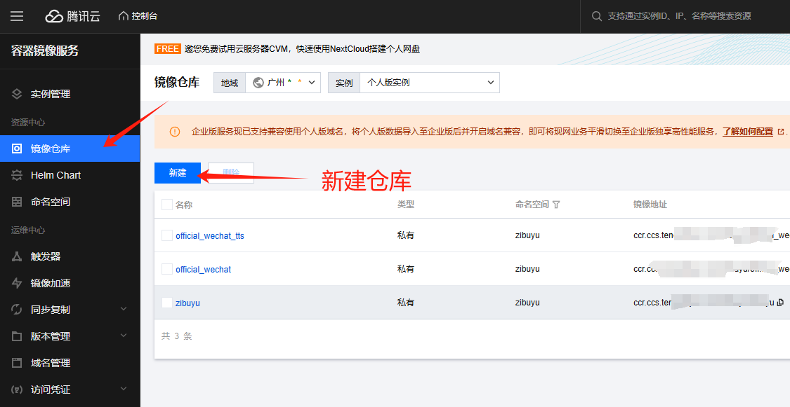


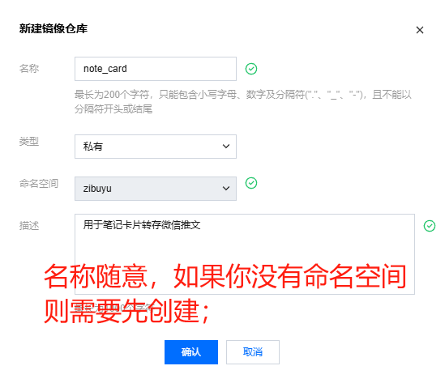

## 3. 在新建的仓库中，新建镜像构建规则。

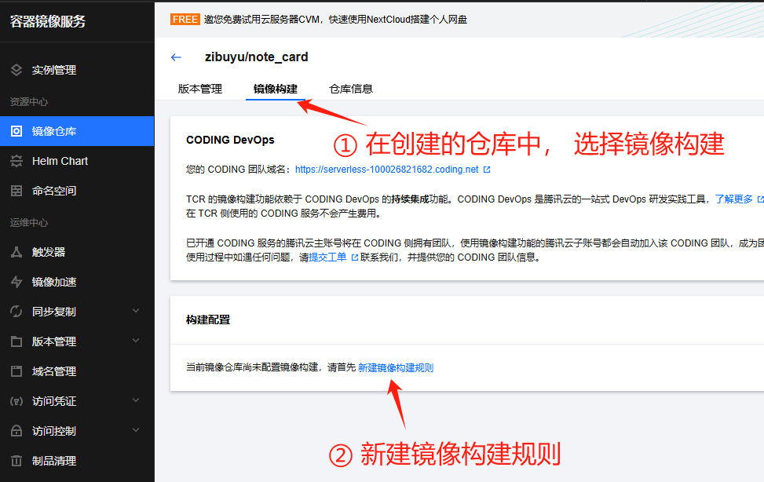

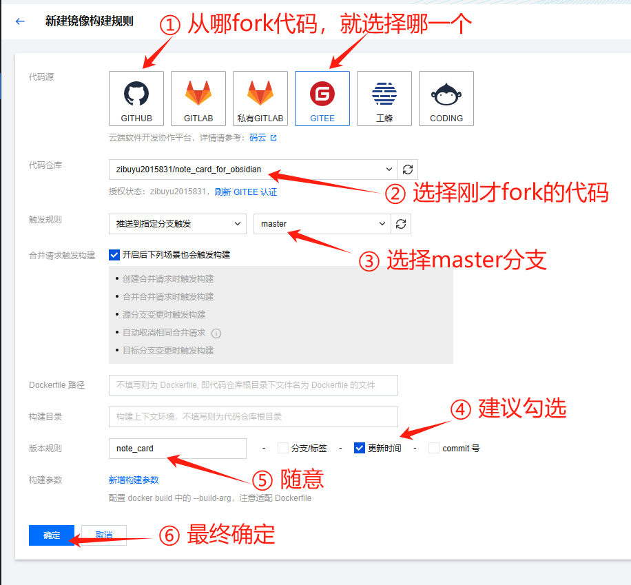

## 4. 构建镜像

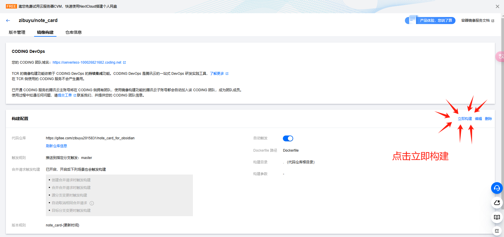

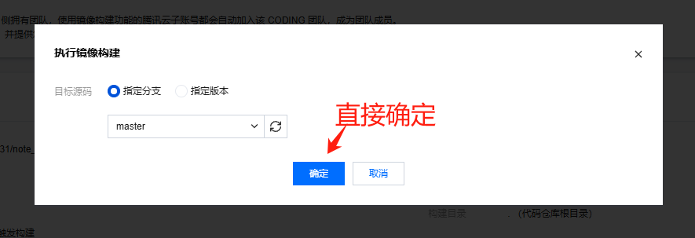


## 5. 进入【函数服务】界面

腾讯的函数服务，新手有三个月的免费额度，而我们使用的功能，如果仅是自己用到话，花费很少，

> 一个月可能一两毛钱吧。


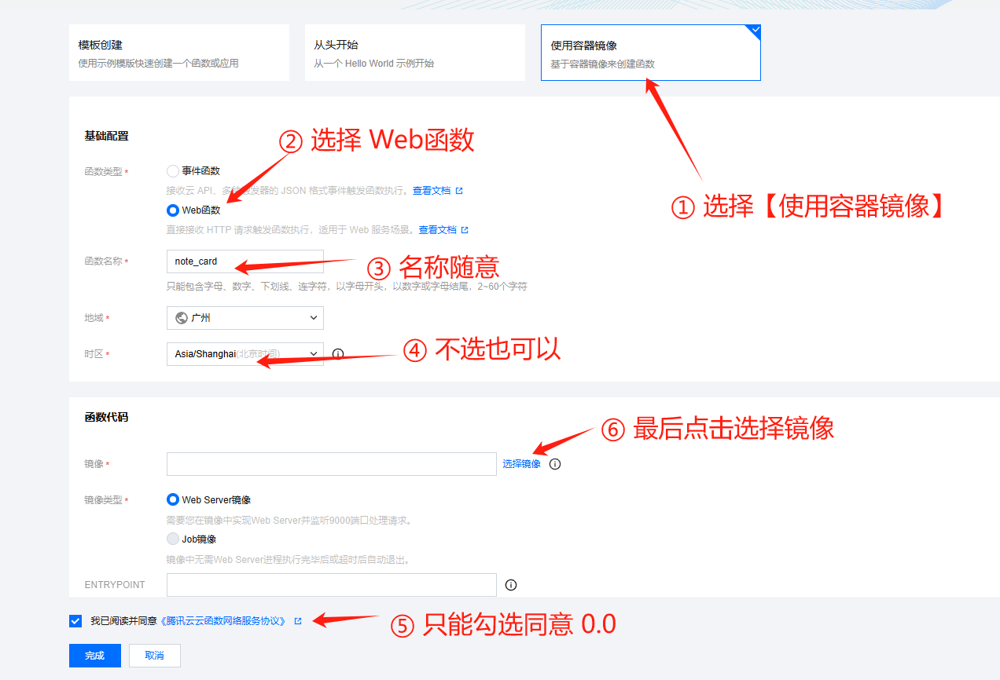

## 6. 选择镜像

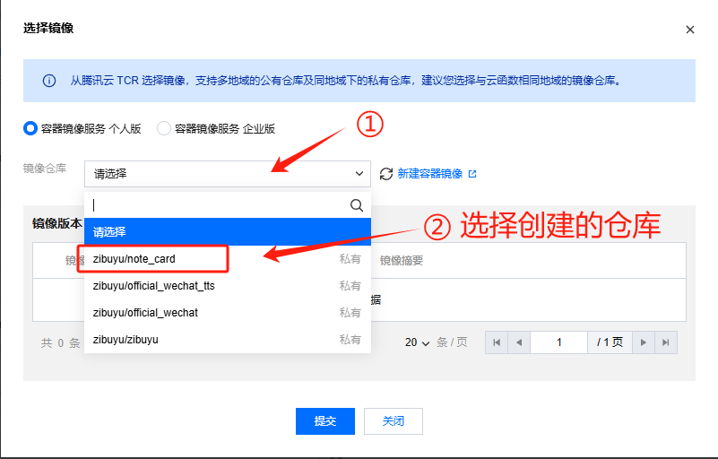

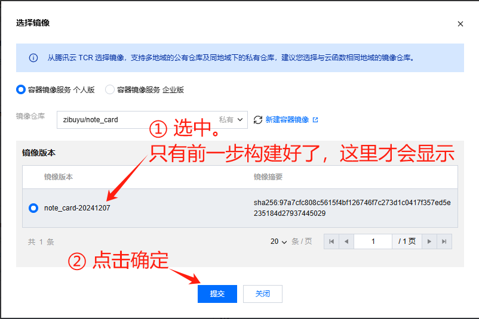

## 7. 填写环境变量

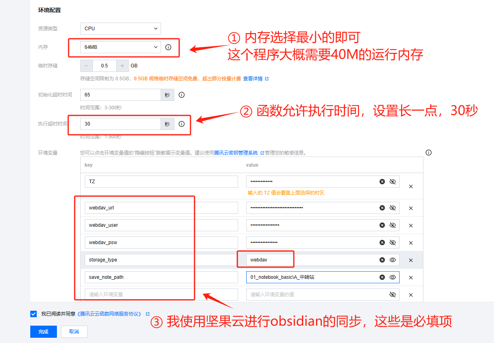

由于程序需要访问你的笔记，较为敏感；

所以关于鉴权之类的信息，都是通过环境变量的方式传入；

我使用坚果云（webdav协议）进行obsidian的笔记同步，需要设置的环境变量如上图。

如果你使用的是其他的同步方案，可以参考下表。

| 参数名称           | 描述                                                     | 是否可选 |
| ------------------ | -------------------------------------------------------- | -------- |
| **storage_type**   | 存储类型，值为“qiniu”或“s3”或“webdav”，默认为“qiniu”     | 可选     |
| token              | 鉴权token，只有token输入正确的请求才会处理；这里不要传入 | 不填     |
| qiniu_access_key   | 七牛云的access_key                                       | 可选     |
| qiniu_secret_key   | 七牛云的secret_key                                       | 可选     |
| bucket_name        | 对象存储bucket的名称；七牛云和s3都需要传入               | 可选     |
| s3_endpoint        | s3对象存储的域名                                         | 可选     |
| s3_region          | s3对象存储的区域                                         | 可选     |
| s3_access_key      | s3对象存储的密钥                                         | 可选     |
| s3_secret_key      | s3对象存储的密钥                                         | 可选     |
| webdav_url         | WebDav对象存储的域名                                     | 可选     |
| webdav_user        | WebDav对象存储的用户名                                   | 可选     |
| webdav_psw         | WebDav对象存储的密钥                                     | 可选     |
| **save_note_path** | 笔记保存路径，必须传入                                   | 必填     |

## 8. 其他设置项


## 9. 获取函数URL


## 10. 给笔记卡片设定webhook地址

由于代码中设置了`/webhook`的访问路径，因此复制的URL后面需要添加该路径；

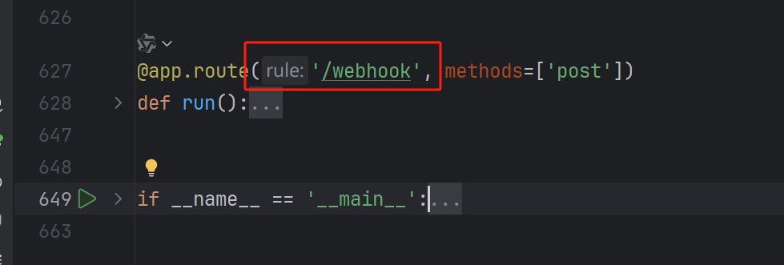

```bash
你复制的URL/webhook
```

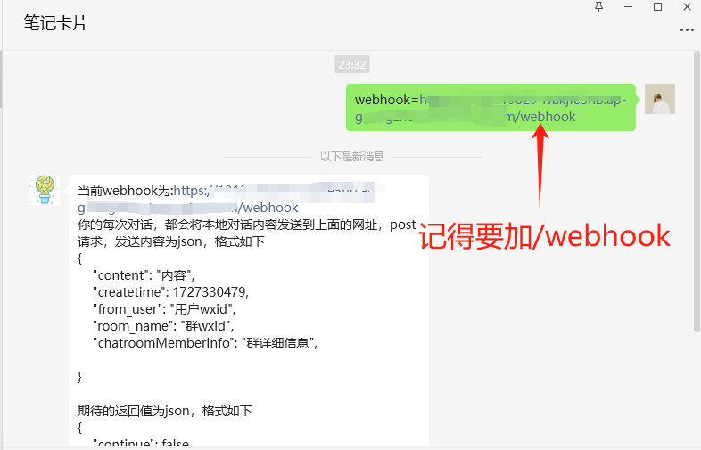


# 鸣谢

特别感谢**海上飞鹏**大佬提供笔记卡片这个微信平台。
